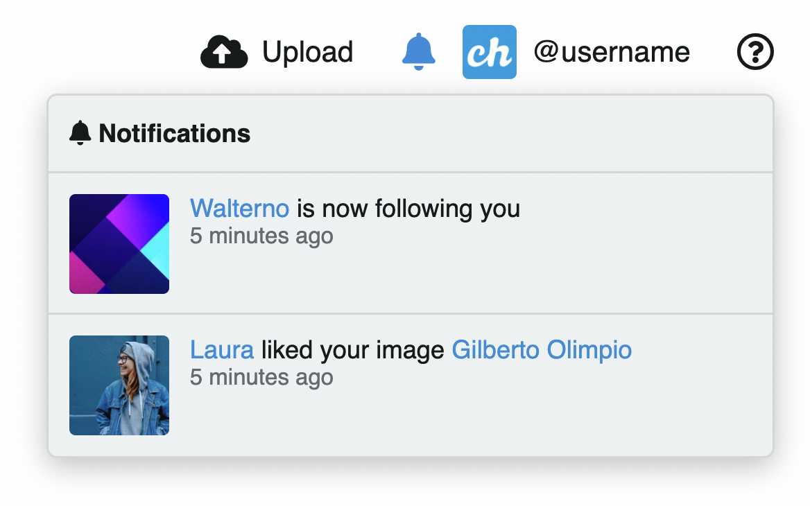
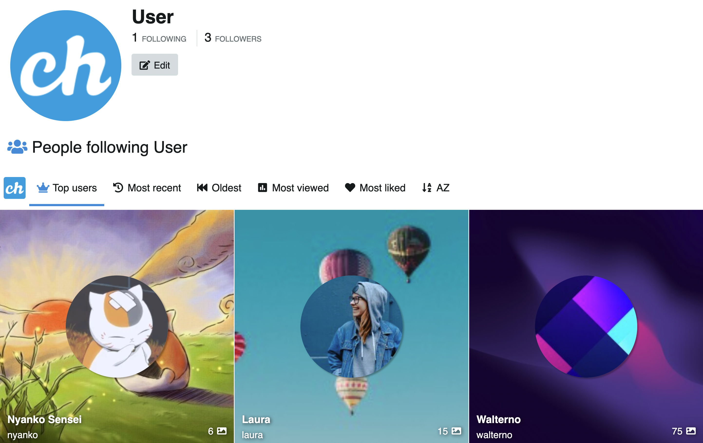

# 🧑🏽 Perfil de usuario

Click en el ícono del usuario para acceder a su contenido y preferencias:

## Notificaciones

Encuentre las notificaciones en la parte superior derecha, al lado del ícono del perfil del usuario.

## Mi perfil

En **Mi perfil** ud accede a su contenido e información de usuario. Puede organizar y personalizar su perfil según sus preferencias y gustos.

### Búsqueda

Para buscar imágenes subidas por el usuario, use el buscador del perfil de usuario.

## Álbum

Para acceder o editar sus álbumes:

- Click en el ícono de usuario y luego click en **Álbumes**

Puede seleccione uno o más álbumes, editarlos de manera individual con las herramientas de cada álbum, o de manera masiva con la ayuda del menú acciones de la derecha.

**Acciones**

Al seleccionar uno o más álbumes se activarán las **Acciones de listado** que ayudarán al usuario a organizar su contenido.

También puede acceder a estas opciones mediante atajos de teclado los cuales se muestran al costado derecho en el menú.

::: tip Aprenda más
Visite 👉🏻 [Listados](../features/listings.md) para más detalles
:::

## Características sociales

<video class="media-screen" width="100%" controls autoplay>
    <source src="../src/manual/settings/user/content/social.webm" type="video/webm">
</video>

### Me gusta

Sistema "Me gusta" / "No me gusta" con un click para imágenes y álbumes. Disponible en listados y en visor de imágenes.

El contenido que le gusta se almacena en la lista de "me gusta" del usuario.

### Listas de seguimiento y seguidores del usuario

Muestra un listado con el contenido subido por las personas que sigue y otro aparte con sus seguidores.

