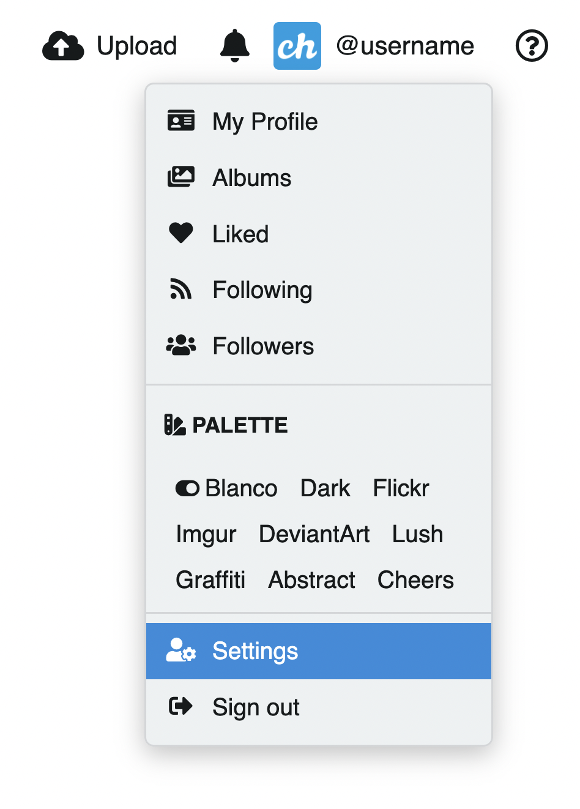
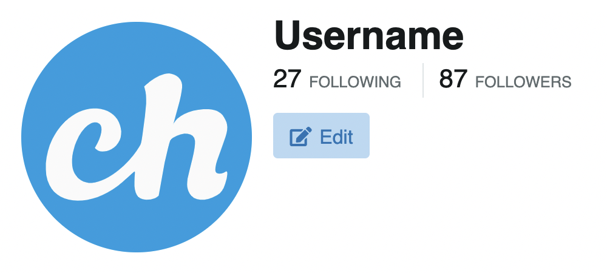

# ⚙️ User settings

Para acceder a los ajustes de cuenta:

1. Click en el ícono de usuario ubicado en la topbar.
2. Click en **Ajustes**

También puede acceder desde el botón **Editar** que se encuentra en el perfil, junto al avatar de usuario.

