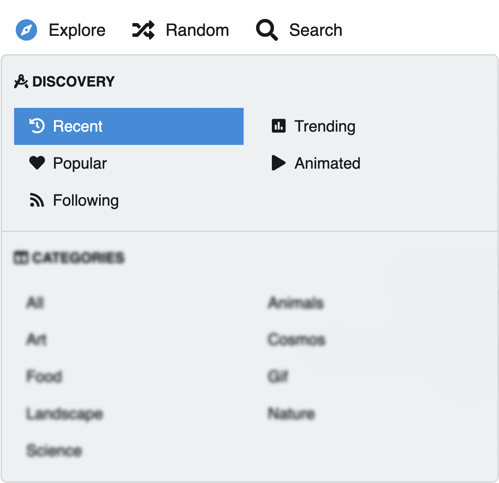
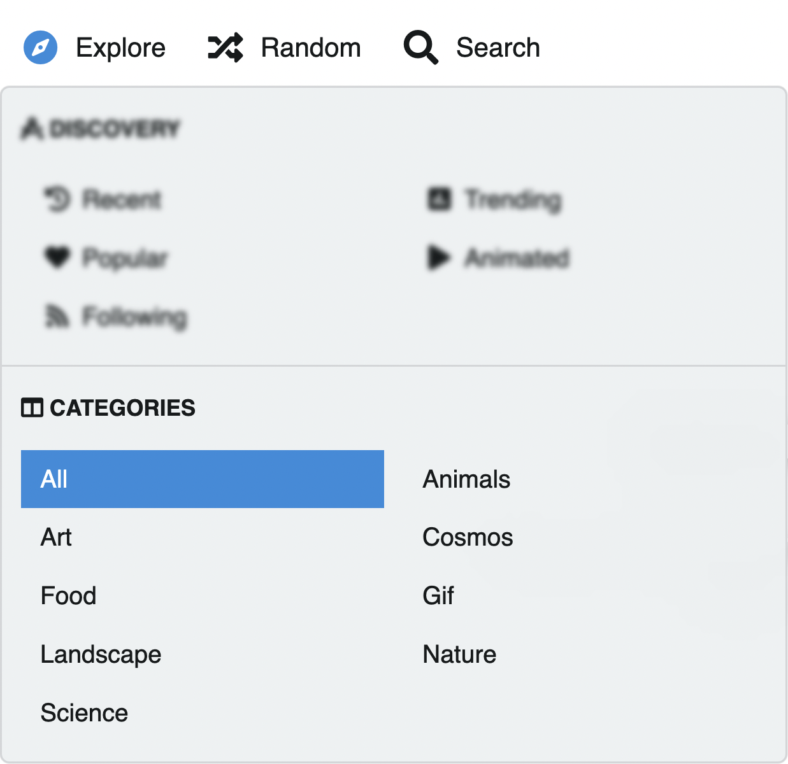

# Explore

El explorador del sitio muestra todas las imágenes del sitio **a excepción de los álbumes privados**.
Estas imágenes se clasifican en distintos listados:

- Recientes
- Tendencias
- Popular
- Animado (GIF)
- Seguidores

## Atajos de teclado

Explore las imágenes a patanlla completa usando los atajos de teclado. Estos se mostrarán en la parte inferior.

<video class="media-screen" width="100%" controls autoplay>
    <source src="../src/manual/explorer/explorer/explore.webm" type="video/webm">
</video>

::: tip Recuerde
Las herramientas de edición están disponibles para los usuarios registrados
:::

Click en la imagen y obtendrá su información y detalles:

## Información

Bajo la imagen y la izquierda encontrará el avatar del usuario, el título de la imagen, álbum al que pertenece y hace cuanto se subió.

### Miniaturas contenido del álbum

Las imágenes que pertenecen a un mismo álbum se muestran en miniaturas agrupadas al pie de la imagen. Usted puede navegar por las imágenes del álbum dando click en las miniaturas.

## Descargar, compartir y más

Bajo la imagen y a la derecha se encuentran los botones:

- Descargar imagen
- Portada de álbum (cover)
- Me gusta
- Compartir

Un poco más abajo el número de visualizaciones:

## Enlaces directos/Urls

Un poco más abajo podrá obtener los enlaces directos y saber más **Acerca** de la imagen.

## Categorías

Las categorías clasifican las imágenes cargadas y generan listados basados ​​en cada categoría. Ud tiene la posibilidad de explorar e incorporar imágenes a estas categorías las cuales han sido creadas por el administrador del sitio.

## Random

Para exlorar el sitio de manera aleatoria, click al botom **Random**

::: tip
Aprenda más sobre 👉🏻 [Acciones y atajos de teclado](../settings/user/actions.md)