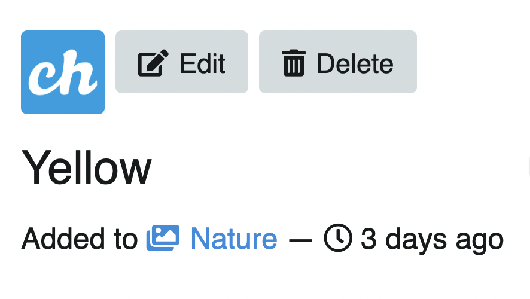
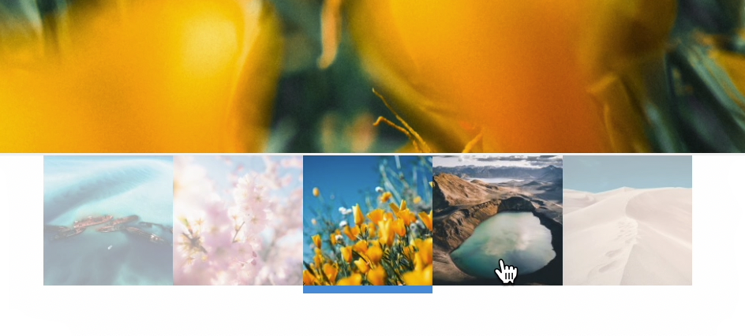
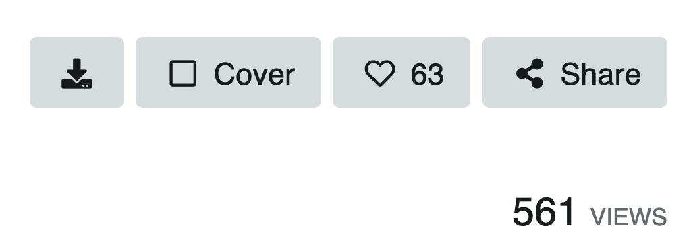
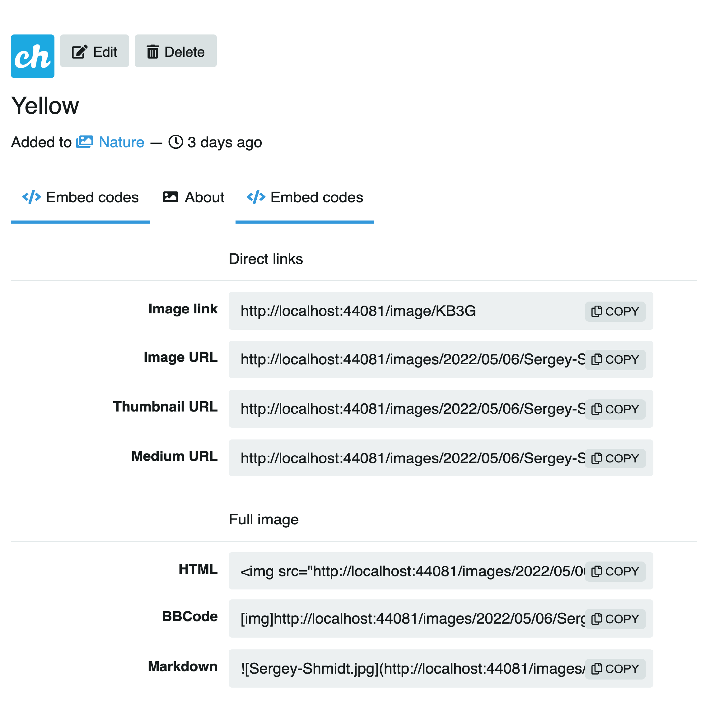

# Imagen

## Información y edición

Bajo la foto y la izquierda, se encuentra el título de la imagen, álbum al que pertenece y hace cuanto se subió.

### Miniaturas contenido del álbum

Las imágenes que pertenecen a un mismo álbum se muestran en miniaturas agrupadas al pie de la imagen. Usted puede navegar por las imágenes del álbum haciendo click en las miniaturas.

## Descargar, compartir y más

Bajo la imagen y a la derecha se encuentran los botones:

* Descargar imagen
* Portada de álbum (cover)
* Me gusta
* Compartir
kv
Un poco más abajo el número de visualizaciones:

## Enlaces directos/Urls

Bajo la información se encuentran los enlaces directos y más **Acerca** de la imagen.

