# 🕹 Listings

Las acciones permiten al usuario administrar todo su contenido. Puede editar de manera masiva dando click en **Todo**, selectivamente dando click derecho en la imagen o arrastrando el cursor para seleccionar varias a la vez:

<video class="media-screen" width="100%" controls autoplay>
    <source src="../src/manual/settings/user/actions/actions.webm" type="video/webm">
</video>

## Herramientas edición individual

En su perfil usted verá que cada álbum o imagen tiene sus propias herramientas e información (editar, eliminar, N° de imágenes, etc).

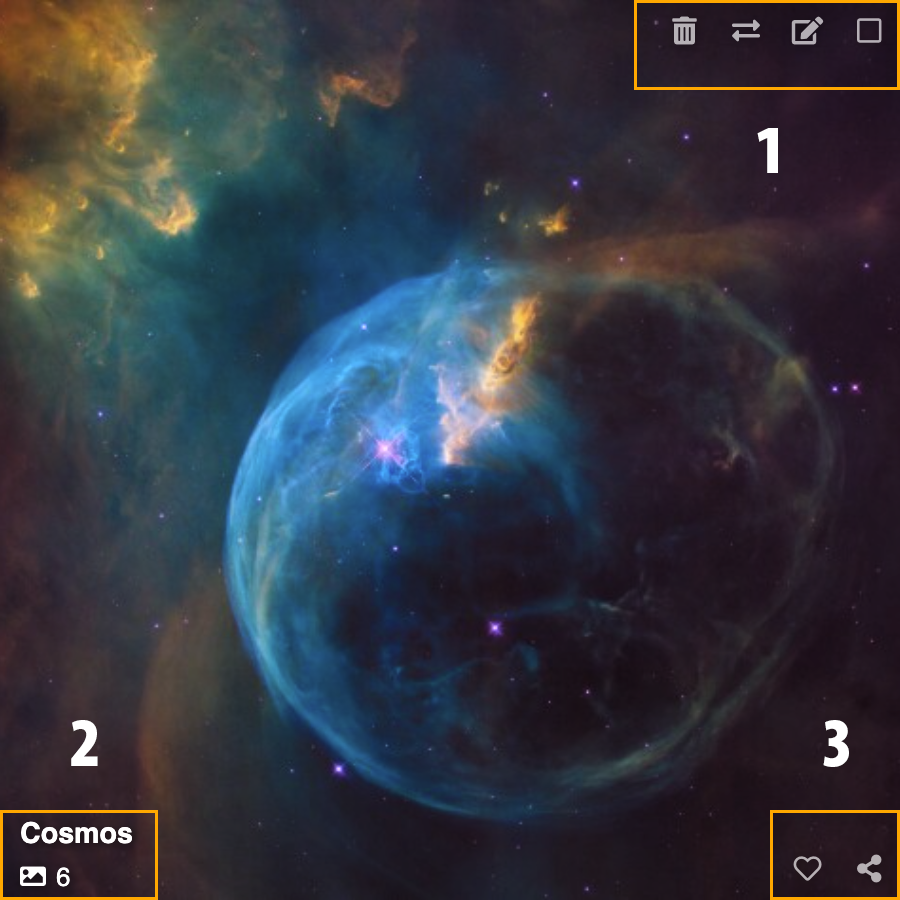

:::details Click aquí para más detalles:

### Álbumes

**1. Superior:**

- Eliminar
- Trasladar
- Editar
- Seleccionar

**2. Esquina inferior izquierda:**

- Nombre del álbum
- Cantidad de imágenes

**3. Esquina inferior derecha:**

- Me gusta
- Compartir

### Imágenes

**1. Superior:**

- Eliminar
- Crear álbum
- Trasladar
- Editar
- Marca de contenido
- Seleccionar

**2. Esquina inferior izquierda:**

- Título de imagen

**3. Esquina inferior derecha:**

- Me gusta
- Compartir
:::

## Acciones álbumes

`username/albums`

- En **Álbumes**; seleccione uno o más álbumes para activar el menú de acciones a la derecha o use los atajos de teclado que se muestran al costado derecho de cada acción:

## Atajos para álbumes

| Acción            | Atajo |
| ----------------- | ----- |
| Crear álbum       | A     |
| Editar álbum      | E     |
| Trasladar a álbum | M     |
| Subir al álbum    | P     |
| Compartir álbum   | S     |
| Eliminar          | Del   |
| Seleccionar todo  | .     |
| Limpiar selección | Z     |
| Crear sub álbum   | J     |

---

::: tip
Atajos de teclado entre paréntesis  `()` .
:::

### Crear álbum (A)

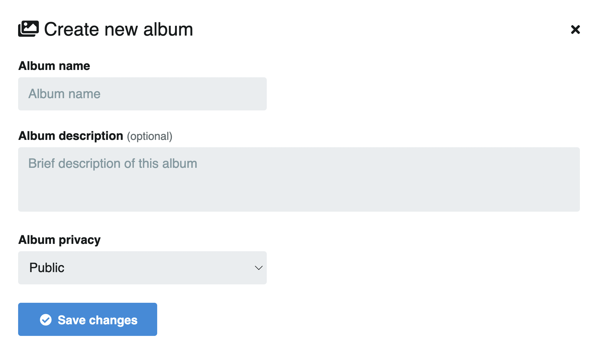

### Privacidad del álbum

Para hacer una o más imágenes privadas, cree un álbum privado o bien edite la privacidad del actual.

### Editar álbum (E)

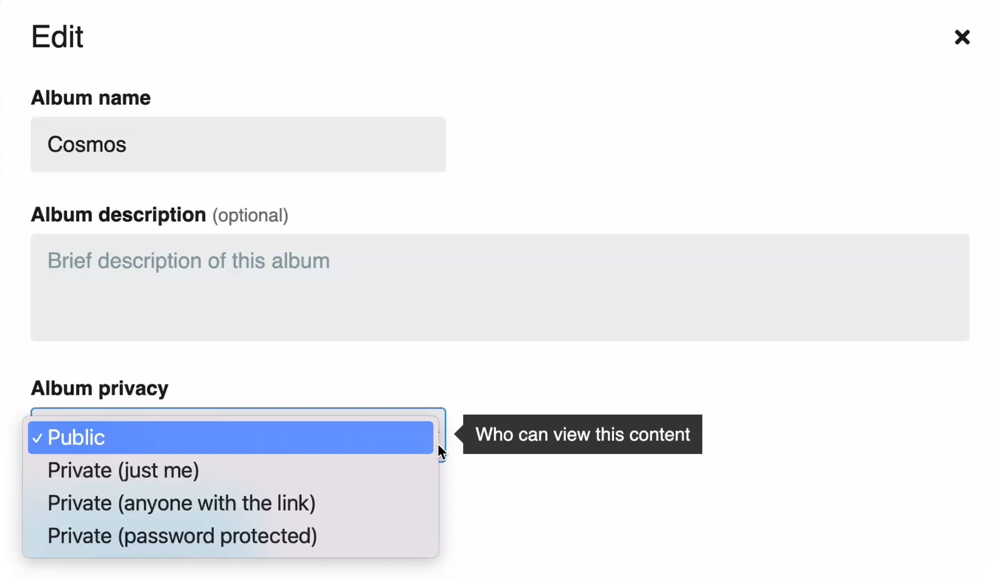

### Trasladar a álbum (M)

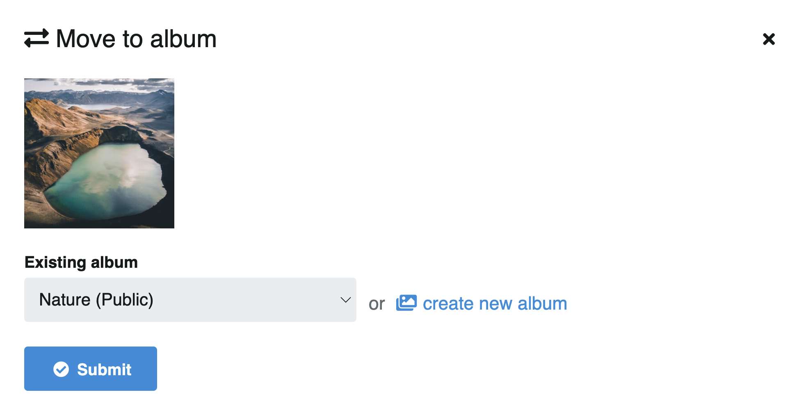

### Subir al álbum (P)

- Puede subir más contenido al álbum dando click en el botón **Subir al álbum** o use el atajo `P`

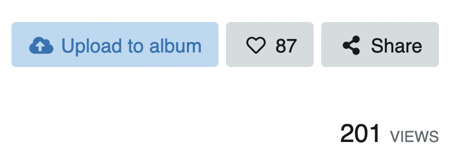

### Compartir álbum (S)

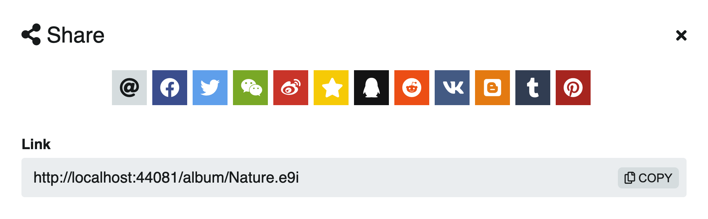

### Eliminar álbum (Del)

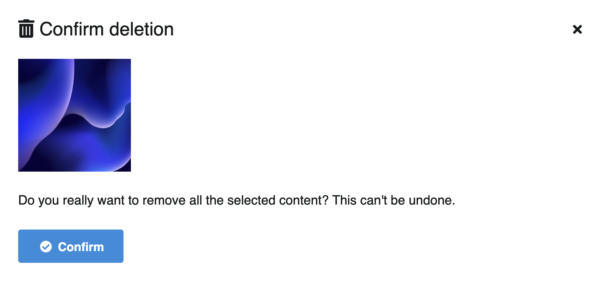

### Seleccionar todo (.)

- Click en **Todo** o use la tecla `.`

- Para limpiar la selección, click en **Limpiar** (en el mismo lugar que **Todo**) o use la tecla `Z`

### Sub album (J)

::: warning Ojo
Debe estar dentro de un álbum para crear un sub álbum.
:::

- Click en el botón **Sub-álbum** que se encuentra sobre el título del álbum, entre **Editar** y **Eliminar** álbum. O simplemente use el atajo `J`

- Complete los datos, la privacidad y guarde los cambios.

Encuentre los álbumes anidados bajo la descripción del álbum, en la pestaña **Sub álbumes**.

Una vez creado el nuevo sub álbum, puede agregar más imágenes (P) o mover las existentes desde otro álbum (M).

<video class="media-screen" width="100%" controls autoplay>
    <source src="../src/manual/settings/user/content/sub-album.webm" type="video/webm">
</video>

### Portada de álbum/Cover (H)

- Para seleccionar una imagen para portada del álbum (cover), click a la imagen de su preferencia y baje hasta la información de la imagen. Encontrará la opción de cover junto al ícono de descarga. Click o use el atajo **H** para seleccionar como cover.

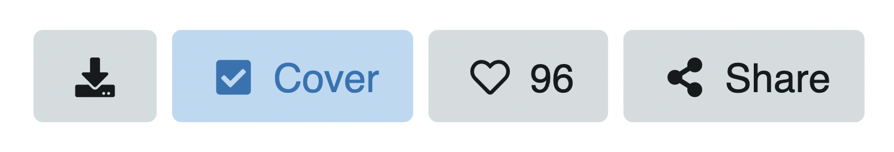

---

## Acciones imágenes

Al entrar en un álbum en específico encontrará más acciones y atajos de teclado para administrar su contenido.

## Atajos imágenes

Al igual que con los álbumes, seleccione una o más imágenes para activar el menú de acciones a la derecha:

| Acción                | Atajo |
| --------------------- | ----- |
| Obtener códigos       | K     |
| Crear álbum           | A     |
| Trasladar a álbum     | M     |
| Asignar categoría     | C     |
| Marcar como no segura | F     |
| Eliminar              | Del   |
| Seleccionar todo      | .     |
| Limpiar selección     | Z     |
| Me gusta              | L     |
| Compartir             | S     |

Varias acciones son iguales a las de los álbumes, a continuación se detallan las que son únicas para imágenes que se listan en el álbum:

### Obtener códigos (K)

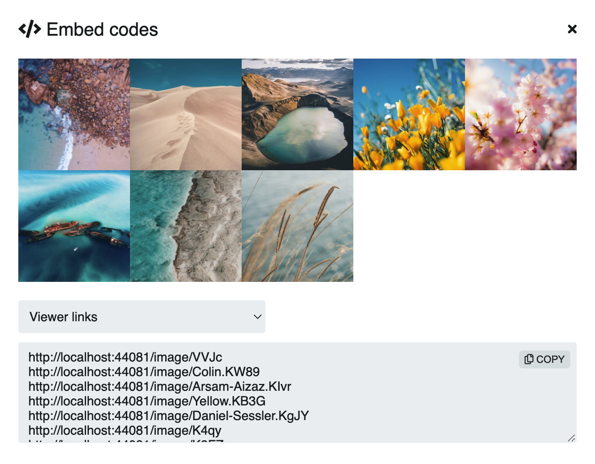

### Asignar categoría (C)

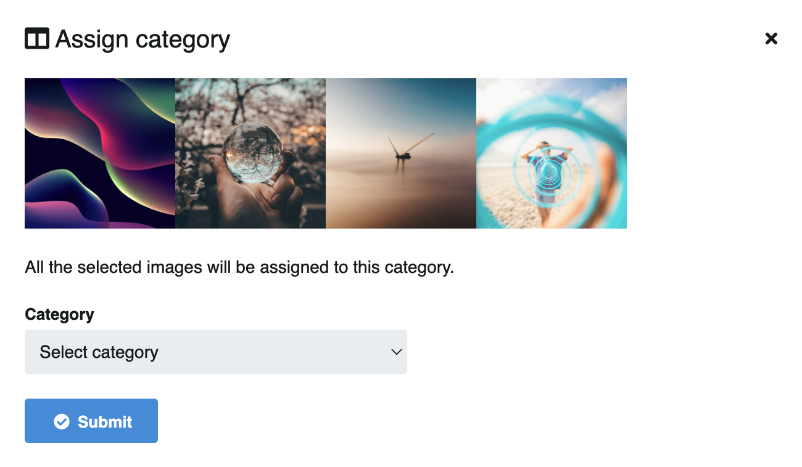

### Marcar como no segura (F)

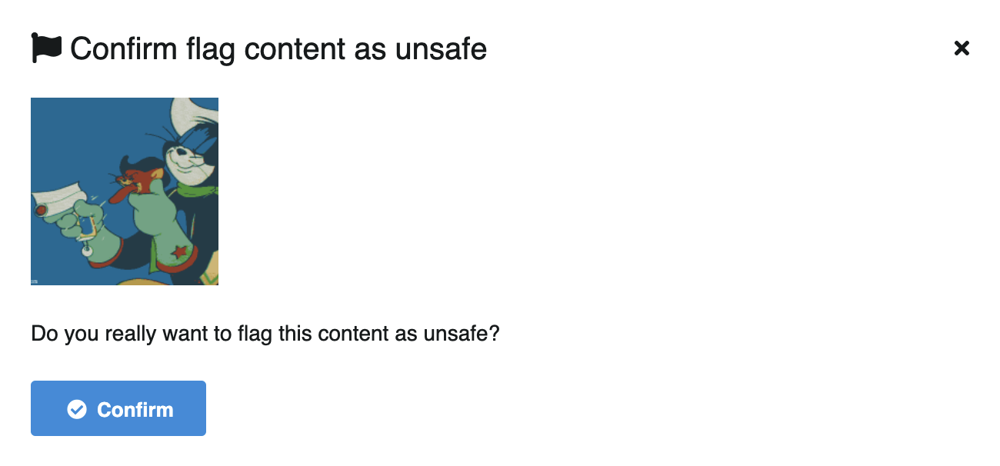

### Me gusta (L)

- Vaya a la imágen y al lado del botón **Compartir** podrá dar **Me gusta** o use el atajo `L`

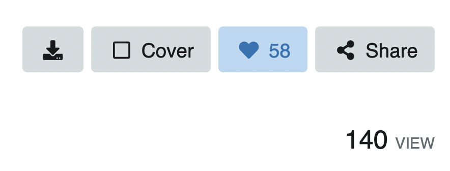

:::tip
👉🏻  [Información de imagen](../explorer/explore.md)
:::
