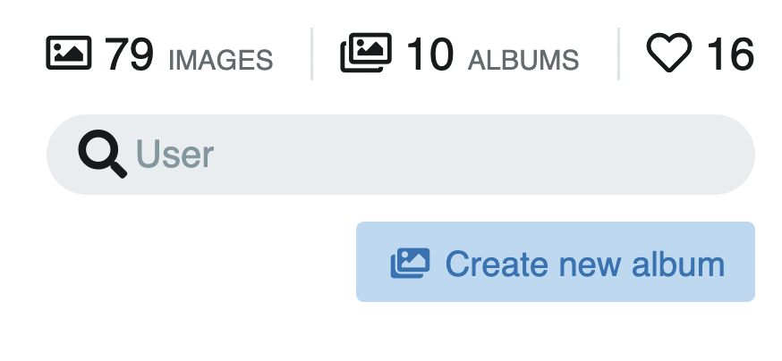
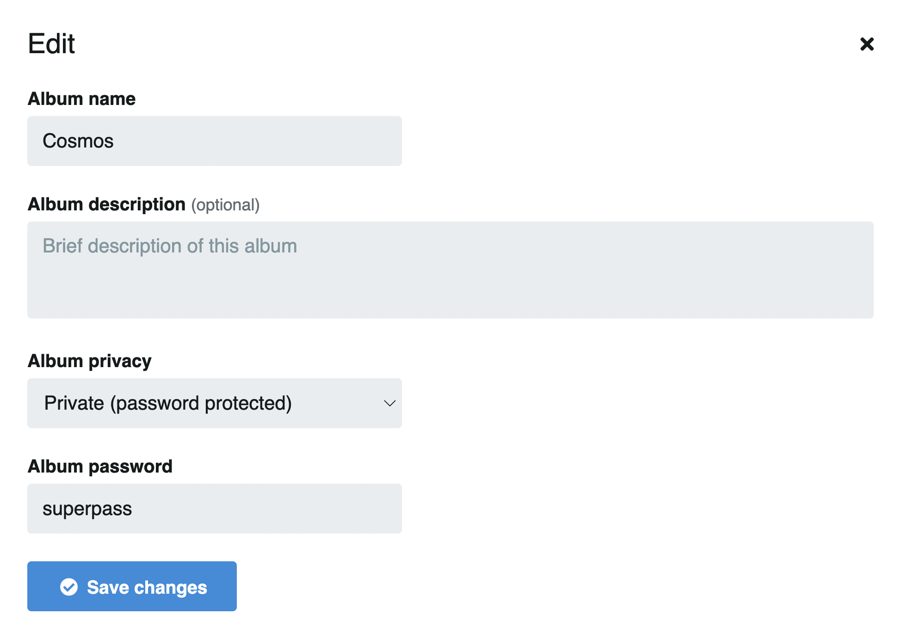
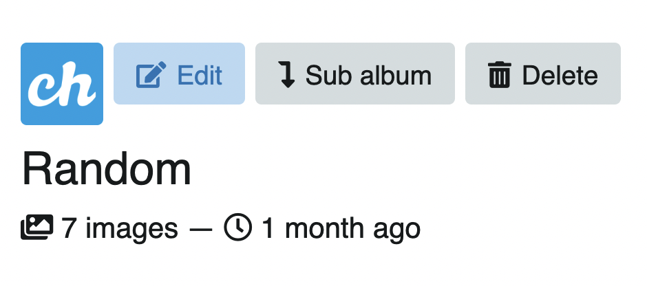
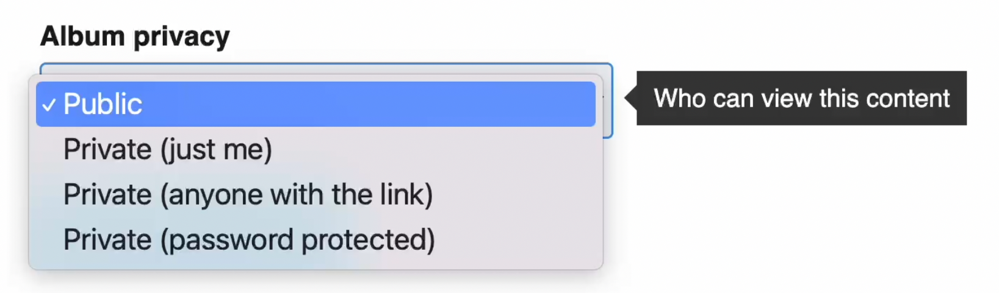
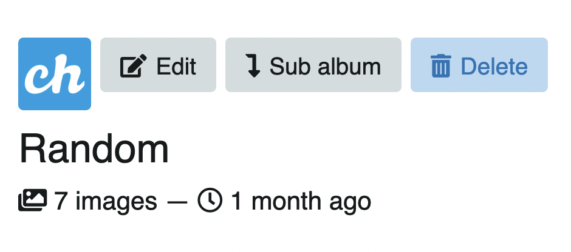
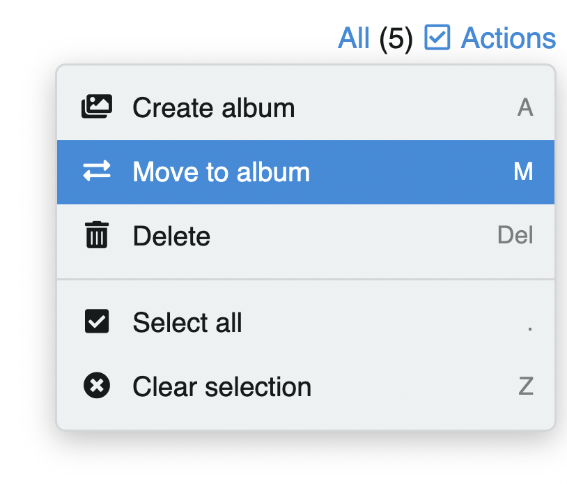
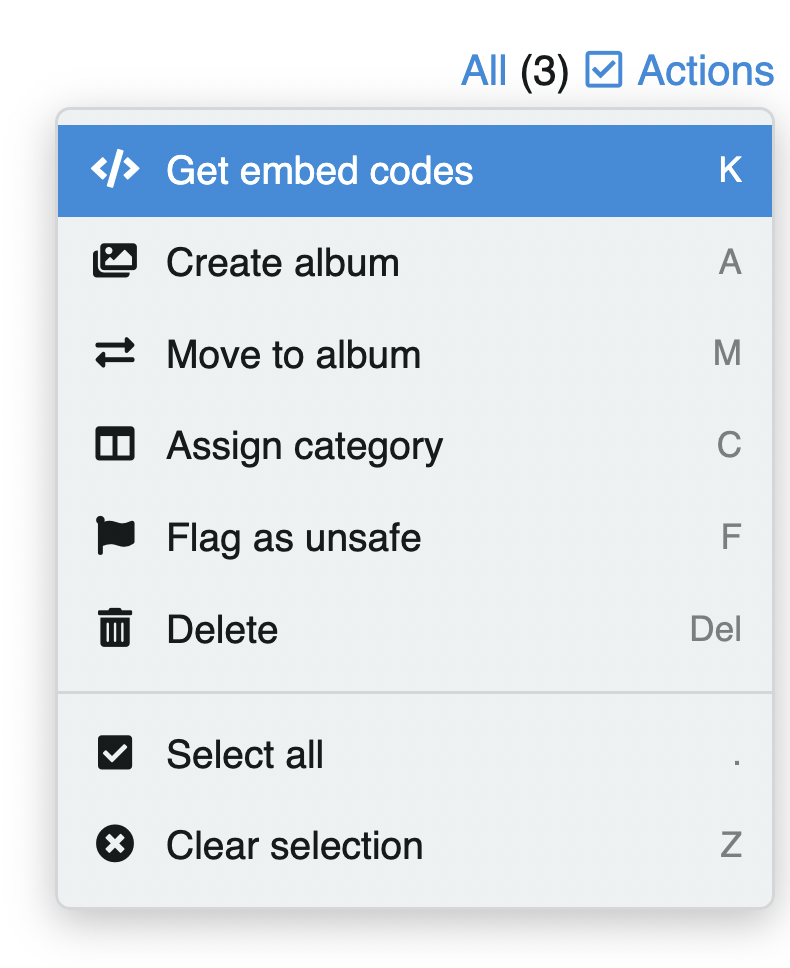

# 🕹 Listings

Los listados se pueden ordenar por:

- Más reciente
- Más antiguo
- Más visto
- Más me gusta
- A-Z
- Usuarios top (solo en seguidores y seguidos)

## Edición múltiple

Para editar de manera masiva, click en **Todo** o use el comando `.`.
También puede hacer click derecho en la imagen o arrastre el cursor para seleccionar varias a la vez:

<video class="media-screen" width="100%" controls autoplay>
    <source src="../src/manual/settings/user/actions/actions.webm" type="video/webm">
</video>

## Edición individual

Cada álbum o imagen tiene sus propias herramientas e información:

- Eliminar
- Crear álbum (imágenes)
- Trasladar
- Editar
- Marca de contenido (imágenes)
- Seleccionar
- Título
- N° de imágenes (álbumes)
- Me gusta
- Compartir

## Tabla atajos de teclado

| Acción | Tecla | Imágenes | Álbumes |
| --------------------- | ----- | - | - |
| Crear álbum | `A` | | ✅  |
| Editar | `E` | ✅  | ✅  |
| Subir al álbum | `P` | | ✅  |
| Compartir | `S` | ✅  | ✅  |
| Crear sub álbum | `J` | | ✅  |
| Obtener códigos | `K` | ✅  | |
| Trasladar a álbum | `M` | ✅  | ✅  |
| Asignar categoría | `C` | ✅  | |
| Marcar como no segura | `F` | ✅  | |
| Eliminar | `Del` | ✅  | ✅  |
| Seleccionar todo | `.` | ✅  | ✅  |
| Limpiar selección | `Z` | ✅  | ✅  |
| Me gusta | `L` | ✅  | |
| Compartir | `S` | ✅  | |

## Acciones

Seleccione uno o más álbumes/imágenes para activar el menú de acciones a la derecha o use los atajos de teclado que se muestran en el mismo menú, al costado derecho de cada acción:

:::tip
Comando entre paréntesis `()`.
:::

### Crear álbum (A)

---

- Use el comando `A` desde el perfil de usuario para crear nuevos álbumes.

O también puede crear un nuevo álbum con el botón que se encuentra bajo el buscador del perfil.

### Editar álbum (E)

---

- En sus albumes, click en el álbum a editar y use el comando `E`.

O click en el botón **Editar** que se encuentra a la izquierda del álbum.

### Privacidad del álbum

---

Seleccione el tipo de privacidad para su álbum:

- Público
- Privado (Solo yo)
- Privado (Cualquiera con enlace)
- Privado (Protegido con contraseña)

:::tip Imágenes privadas
Las imágenes serán privadas si están dentro de un álbum o sub álbum privado. Las imágenes por si solas no pueden ser privadas.
:::

### Eliminar álbum (Del)

---

- Vaya a sus álbumes y seleccione uno o más albumes para eliminar.
- Use el comando `Del` para eliminar y confirme.

O click en el álbum y luego en el botón **Eliminar** que se encuentra sobre el título del álbum.

### Trasladar a álbum (M)

---

- Seleccione las imágenes o álbumes.
- Use el comando `M` y envíe.

Puede trasladas a un álbum existente o crear un nuevo álbum. Todas las imágenes o álbumes se moverán a al álbum que escoja.

Esta opción también la encuentra en el menú de acciones a la derecha.

### Subir al álbum (P)

---

Para agregar más contenido al álbum:
- Click en el botón **Subir al álbum** o use el atajo `P` en el álbum en donde desee agregar más imágenes.

### Compartir álbum (S)

---

- Vaya al álbum que desea compartir
- Use el comando `S` y se abrirá el cuadro con la url y redes sociales para compartir.

### Seleccionar todo (.)

---

- Click en **Todo** o use la tecla `.`

- Para limpiar la selección, click en **Limpiar** (a la derecha) o use la tecla `Z`. O simplemente use el atajo `J`

### Sub album (J)

---

- Click en el botón **Sub-álbum** que se encuentra sobre el título del álbum.

- Complete los datos, la privacidad y guarde los cambios.

Encuentre los álbumes anidados bajo la descripción del álbum, en la pestaña **Sub álbumes**.

Una vez creado el nuevo sub álbum, puede agregar más imágenes (P) o mover las existentes desde otro álbum (M).

<video class="media-screen" width="100%" controls autoplay>
    <source src="../src/manual/settings/user/actions/sub-album.webm" type="video/webm">
</video>

### Portada de álbum/Cover (H)

---

- Para seleccionar una imagen para portada del álbum (cover), click a la imagen de su preferencia y baje hasta la información. Encontrará la opción de cover junto al ícono de descarga. Click o use el atajo **H** para seleccionar como cover.

### Obtener códigos (K)

---

- Seleccione una o más imágenes y use el atajo `K`.

También encuentra esta opción en el menú de acciones a la derecha.

### Asignar categoría (C)

---

- Seleccione una o más imágenes y use el atajo `C`.
O use el menú de acciones a la derecha.

### Marcar como no segura (F)

---

- Seleccione una o más imágenes y use el atajo `F`.
O use el menú de acciones a la derecha.

### Me gusta (L)

---

Una manera sencilla de dar **Me gusta** al contenido, es haciendo click en el ícono de corazón de la imagen o álbum que está visualizando.

- Vaya a la imágen de su agrado y use el comando `L`. 
- Esta opción también la encuentra al lado del botón **Compartir** de la imágen.

:::tip
👉🏻  [Información de imagen](../explorer/explore.md)
:::