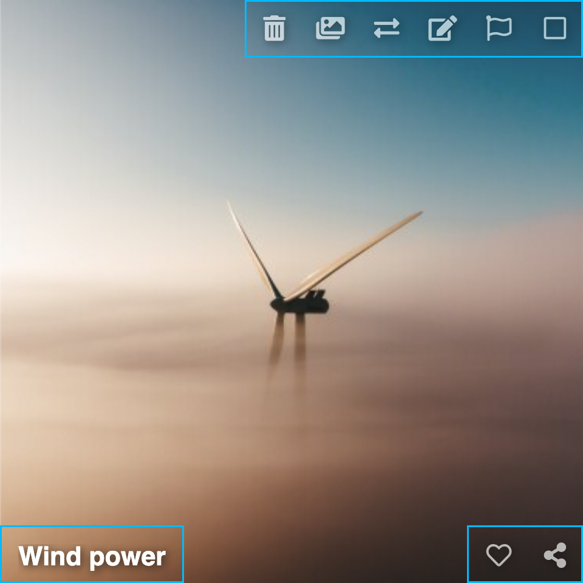

# 📝 Edición

Requiere [🔐 Ingreso](../../user/account/login.md).

Las opciones de edición en Chevereto permiten editar el contenido presente en un listado. Dependiendo del contexto del listado se ofrecerán distintas [Acciones](actions.md).

<video class="media-screen" width="100%" controls autoplay>
    <source src="../../src/manual/settings/user/actions/actions.webm" type="video/webm">
</video>

## Edición múltiple

* Para seleccionar todo el listado click en **Todo** o la tecla `.`
* Click en la **casilla de verificación** para seleccionar elementos
* **Click derecho** (long press) para seleccionar elementos
* **Arrastre** selección con el cursor para seleccionar elementos
* Click en **Acciones**

## Edición individual

Cada elemento tiene sus propias opciones de edición:

### Imágenes

* Eliminar
* Crear álbum
* Trasladar
* Editar
* Bandera NSFW (contenido no seguro)
* Me gusta
* Compartir

### Álbumes

* Eliminar
* Trasladar
* Editar
* Me gusta
* Compartir

<!--  -->
