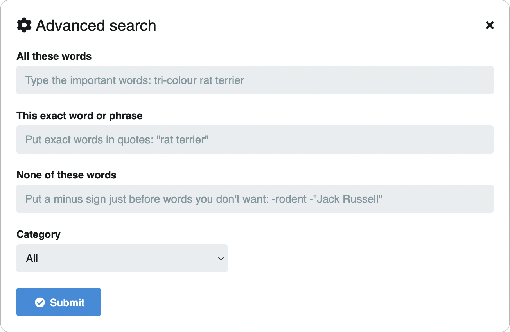

# 🔍 Búsqueda

## Modo básico

En la topbar encontrará una lupa 🔍 en donde podrá realizar las búsquedas:

## Modo avanzado

### Búsqueda específica por palabras claves

Click al engranaje ⚙️ para abrir la ventana de búsqueda avanzada:

## Búsqueda en perfil de usuario

Para encontrar imágenes de un usuario en específico, vaya al perfil y use el buscador del perfil. Para más detalles vea la sección 👉🏻 [Contenido del usuario](../settings/user/content.md)

