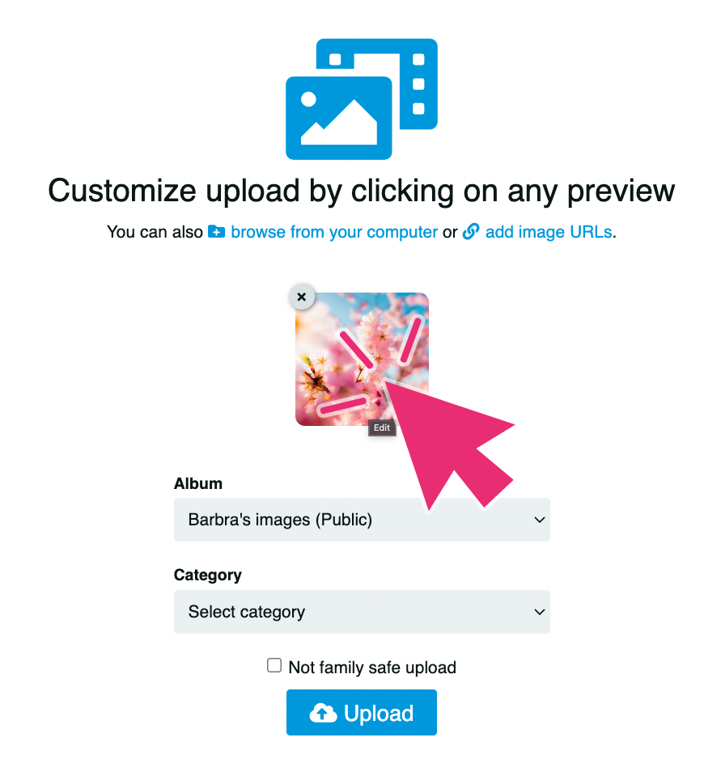
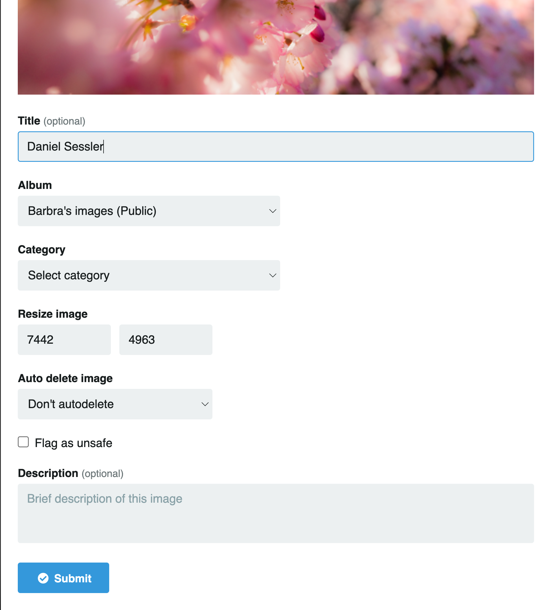

# Upload Options

## Edición avanzada

Después de haber seleccionado las imágenes para la carga, puedes editar cualquiera de estas haciendo click en la vista previa.

- Con los valores listos, click en **Submit**
- Finalmente para subir el contenido, click en **Upload**

- - -

*Formatos soportados (JPG, PNG, BMP, GIF, WEBP)*
