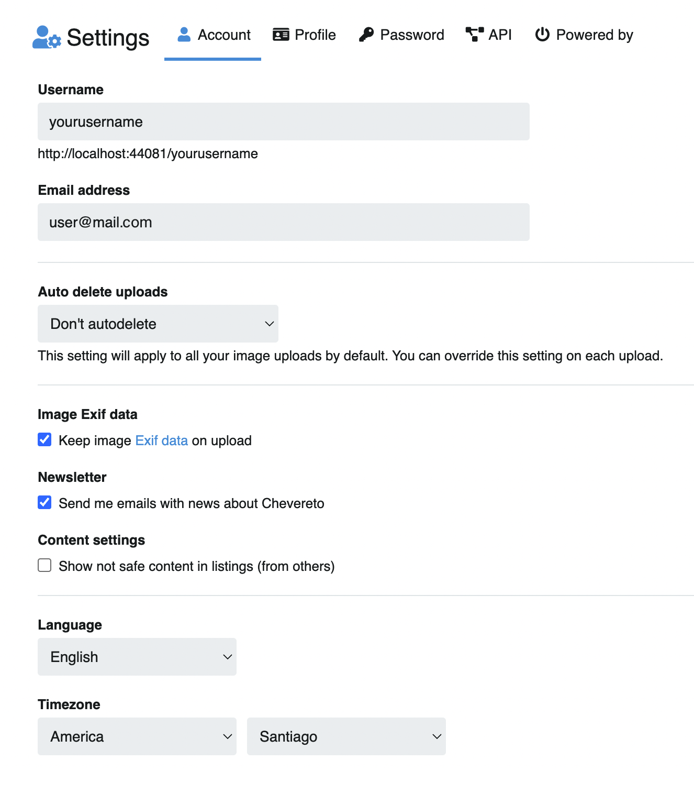

# Settings

:::tip Nota
La configuración de la cuenta la encuentra directamente en `/settings`.
:::

Paso a paso para acceder a los ajustes de cuenta:

1. Click en el ícono de usuario ubicado en la topbar.
2. Click en **Ajustes**

También puede acceder desde el botón **Editar** que se encuentra en el perfil, junto al avatar de usuario.

---

En la parte superior de los ajustes de usuario encontrará tres pestañas:

- [Cuenta](account/account.md)
- [Perfil](user/profile.md)
- [Contraseña](account/pass.md)
- [Api](account/api.md)

Revise el menú a la izquierda para obtener más información.
