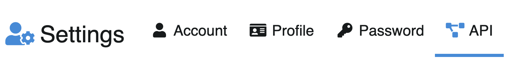
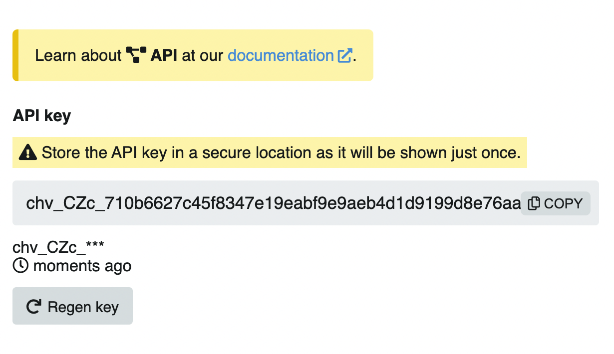

# Api
La API funciona con clave de usuario la cual está disponible de manera directa en `/settings/api.`

::: tip API
Aprende más sobre la 👉🏻 [API](https://v4-docs.chevereto.com/api/api-v1.html)
:::

Para acceder a la API, en **Ajustes**, click en **API**

Para mayor seguidad, luego de conocer la llave, este se presentará de la siguiente manera:

