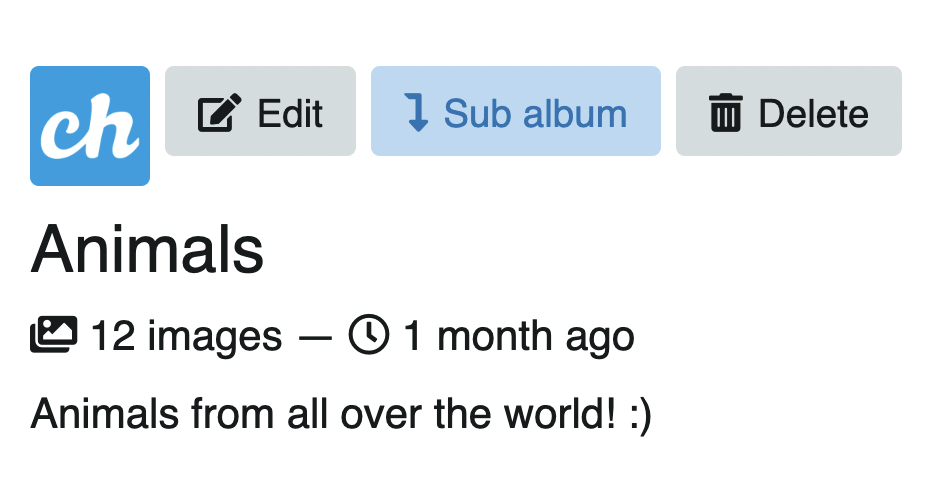
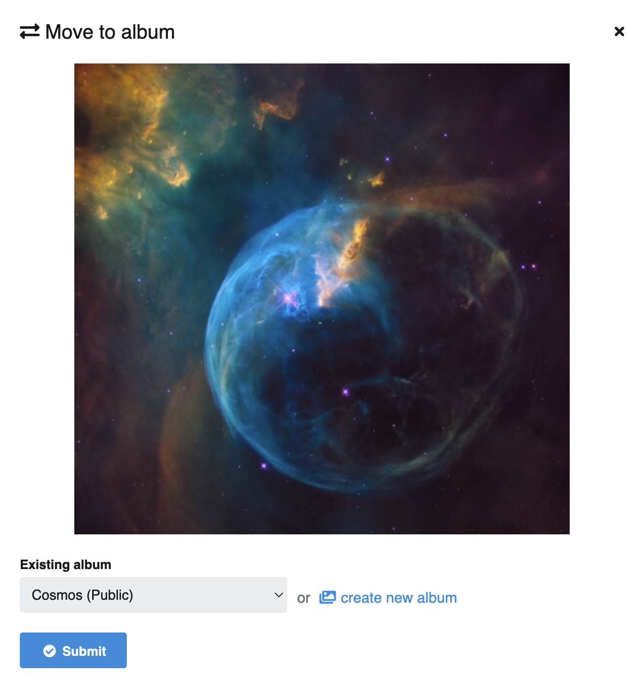

# Acciones `username/`

Las acciones permiten al usuario administrar todo su contenido. Puede editar de manera masiva dando click en **Todo**, selectivamente dando click derecho en la imagen o arrastrando el cursor para seleccionar varias a la vez:

<video class="media-screen" width="100%" controls autoplay>
    <source src="../../src/manual/settings/user/actions/actions.webm" type="video/webm">
</video>

## Herramientas edición detallada

En su perfil usted verá que cada álbum o imagen tiene sus propias herramientas e información:

:::details
### Álbumes

**1. Superior:**

- Eliminar
- Trasladar
- Editar
- Seleccionar

**2. Esquina inferior izquiera:**

- Nombre del álbum
- Cantidad de imágenes

**3. Esquina inferior derecha:**

- Me gusta
- Compartir

### Imágenes

**1. Superior:**

- Eliminar
- Crear álbum
- Trasladar
- Editar
- Marca de contenido
- Seleccionar

**2. Esquina inferior izquierda:**

- Título de imagen

**3. Esquina inferior derecha:**

- Me gusta
- Compartir
:::

## Acciones álbumes

`username/albums`

- En **Álbumes**; seleccione uno o más álbumes para activar el menú de acciones a la derecha:

## Atajos para albumes

|Acción|Atajo|
|--------|---------|
|Crear álbum|A|
|Trasladar a álbum|M|
|Eliminar|Del|
|Seleccionar todo|.|
|Limpiar selección|Z|
|Editar álbum|E|
|Crear sub álbum|J|

## Editar álbum (E)

- Vaya a **Álbumes** 
- Click en **Editar** o al presionar la tecla **E**

## Sub album (J)

Debe estar dentro de un album para crear un sub album.

Para crear una "subcarpeta", click en **Sub-album**.

Complete los datos y guarde los cambios.

Una vez creado el nuevo sub álbum, puede agregar más imágenes o mover las existentes al sub álbum.

Encuentre los albumes anidados bajo la descripción del álbum, en la pestaña **Sub álbumes**.

<video class="media-screen" width="100%" controls autoplay>
    <source src="../../src/manual/settings/user/content/sub-album.webm" type="video/webm">
</video>

## Trasladar/Mover a (M)

## Portada de álbum/Cover (H)

Para seleccionar una imagen para portada del álbum (cover), click a la imagen de su preferencia y baje hasta la información de la imagen. Encontrará la opción de cover junto al ícono de descarga. Click o use el atajo **H** para seleccionar como cover.

---

## Acciones imágenes

Al entrar en un álbum en específico encontrará más acciones y atajos de teclado para administrar su contenido. Podrá subir más imágenes, crear sub álbumes, reorganizar, etc.

## Atajos imágenes

Al igual que con los álbumes, seleccione una o más imágenes para activar el menú de acciones a la derecha:

|Acción|Atajo|
|--------|---------|
|Obtener códigos|K|
|Crear álbum|A|
|Trasladar a álbum|M|
|Asignar categoría|C|
|Marcar como no segura|F|
|Eliminar|Del|
|Seleccionar todo|.|
|Limpiar selección|Z|
|Subir al álbum|P|
|Me gusta|L|
|Compartir|S|

## Marcar como no segura

:::tip
👉🏻  [Información de imagen](../../explorer/explore.md)
:::