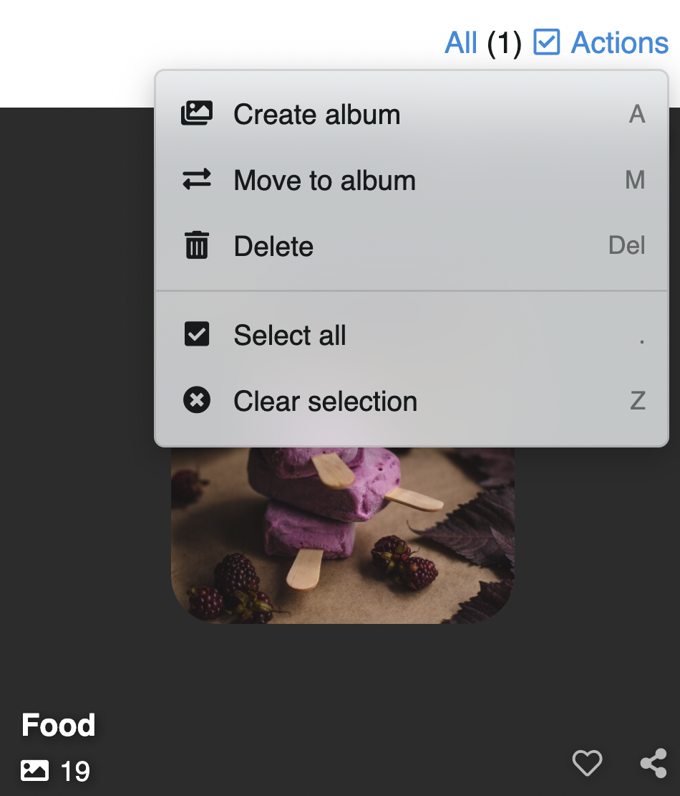

# Contenido del perfil

Como usuario ud podrá editar y organizar sus *Albumes* (e imágenes), *Me gusta*, *Seguidos* y *Seguidores*.

Para ello, click al ícono de usuario en la barra superior y seleccione la opción que requiera.

En cada sección ud podrá navegar según el orden que ud prefiera:

- Más reciente
- Más antiguo
- Más visto
- Más me gusta
- A-Z
- Usuarios top (solo en seguidores y seguidos)

## Mi perfil

En **Mi perfil** ud tendrá acceso a todo el contenido que ud ha subido

## Álbum

Para acceder o editar sus álbumes, click en el ícono de usuario y luego click en **Álbumes**

### Acciones

Si selecciona uno o más de sus álbumes, a su derecha se activará el botón **Acciones**

También puede acceder a estas opciones mediante atajos de teclado los cuales se muestran al costado derecho en el menú.

::: tip Aprenda más
Visite 👉🏻 [La sección Actions](actions.md) para más detalles
:::

## Me gusta

Imágenes a las cuales le has dado **Me gusta**

## Siguiendo

Usuarios que sigues

## Seguidores

Usuarios que te siguen

