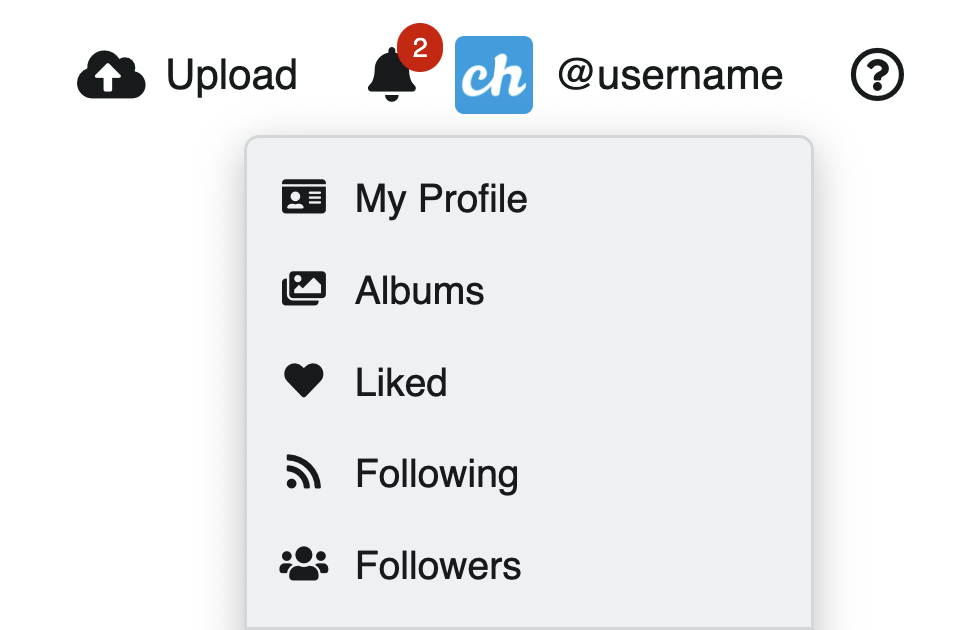
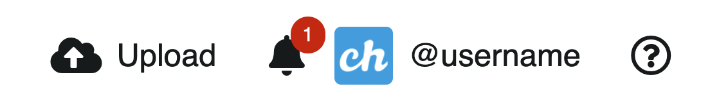
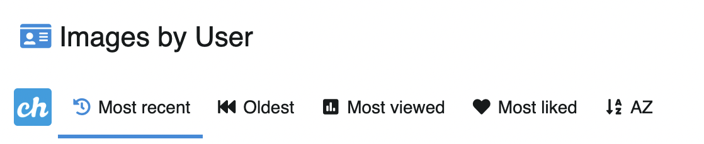
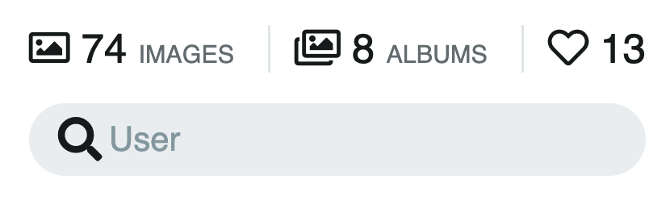
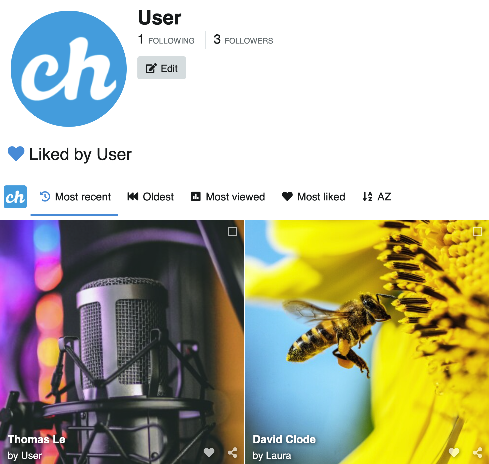
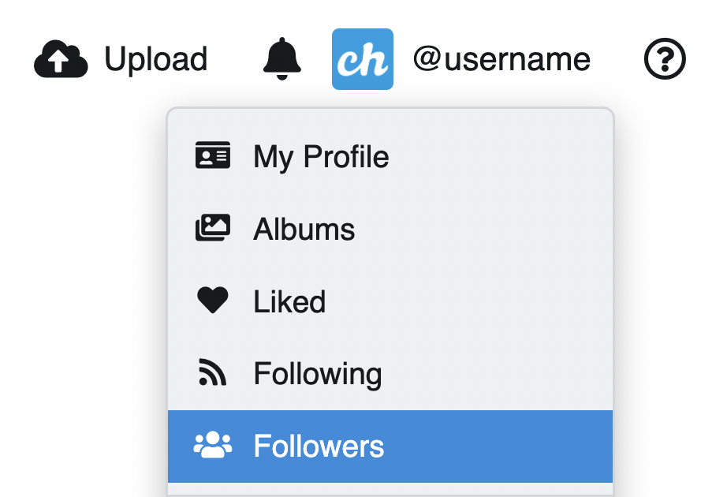

# Contenido del perfil

Click en el ícono del usuario para acceder a su contenido y preferencias:

## Notificaciones

Las notificaciones son alertas instantáneas desencadenadas por la actividad de las redes. Encuentre las notificaciones en la parte superior derecha, al lado del ícono del perfil del usuario.

## Mi perfil

En **Mi perfil** ud tendrá acceso a todo el contenido que ud ha subido

En cada sección ud podrá ordenar según:

- Más reciente
- Más antiguo
- Más visto
- Más me gusta
- A-Z
- Usuarios top (solo en seguidores y seguidos)

## Búscador

Para encontrar imágenes directamente, use el buscador del perfil de usuario.

## Álbum

Para acceder o editar sus álbumes:

- Click en el ícono de usuario y luego click en **Álbumes**
- Seleccione uno o más álbumes a editar
- Edite de manera individual o masiva con la ayuda del menú acciones de la derecha.

### Acciones

Al seleccionar uno o más álbumes se activarán las **Acciones** que ayudarán al usuario a organizar su contenido.

También puede acceder a estas opciones mediante atajos de teclado los cuales se muestran al costado derecho en el menú.

::: tip Aprenda más
Visite 👉🏻 [La sección Acciones](actions.md) para más detalles
:::

## Me gusta

Imágenes a las cuales le has dado **Me gusta**

## Siguiendo

Usuarios que sigues

## Seguidores

Usuarios que te siguen

