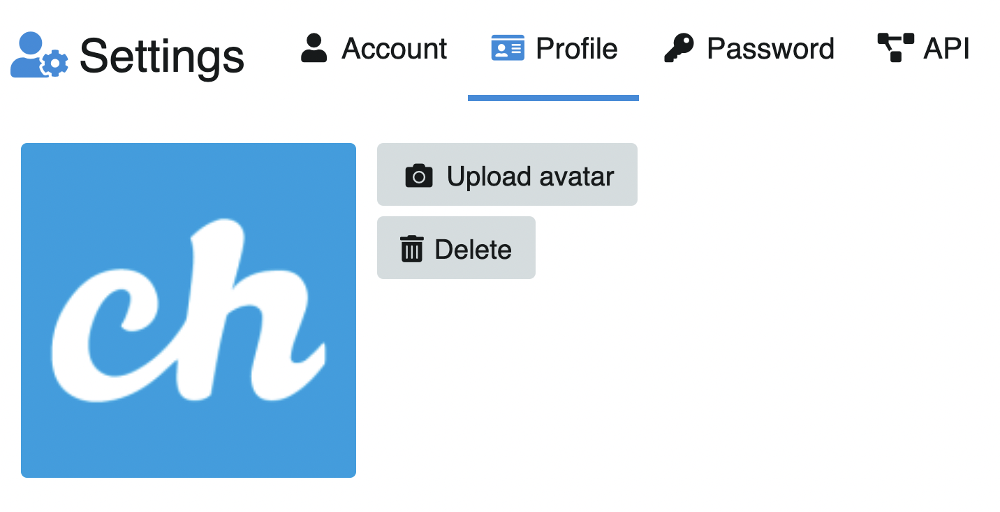
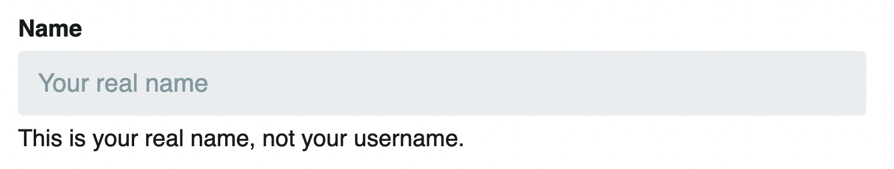
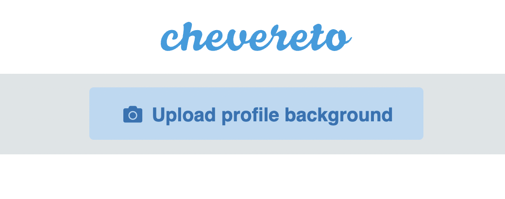
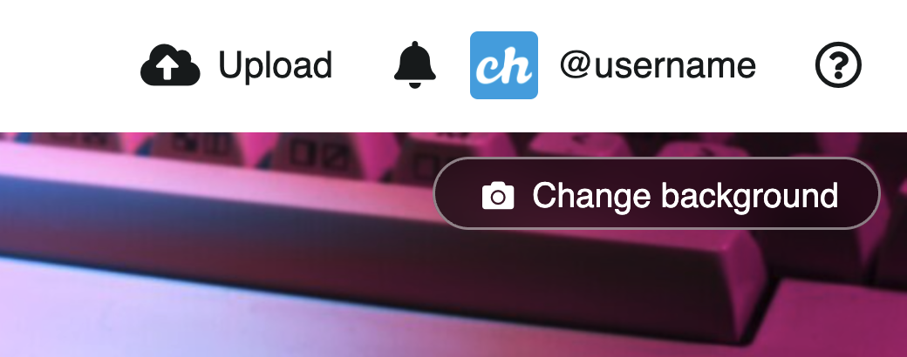
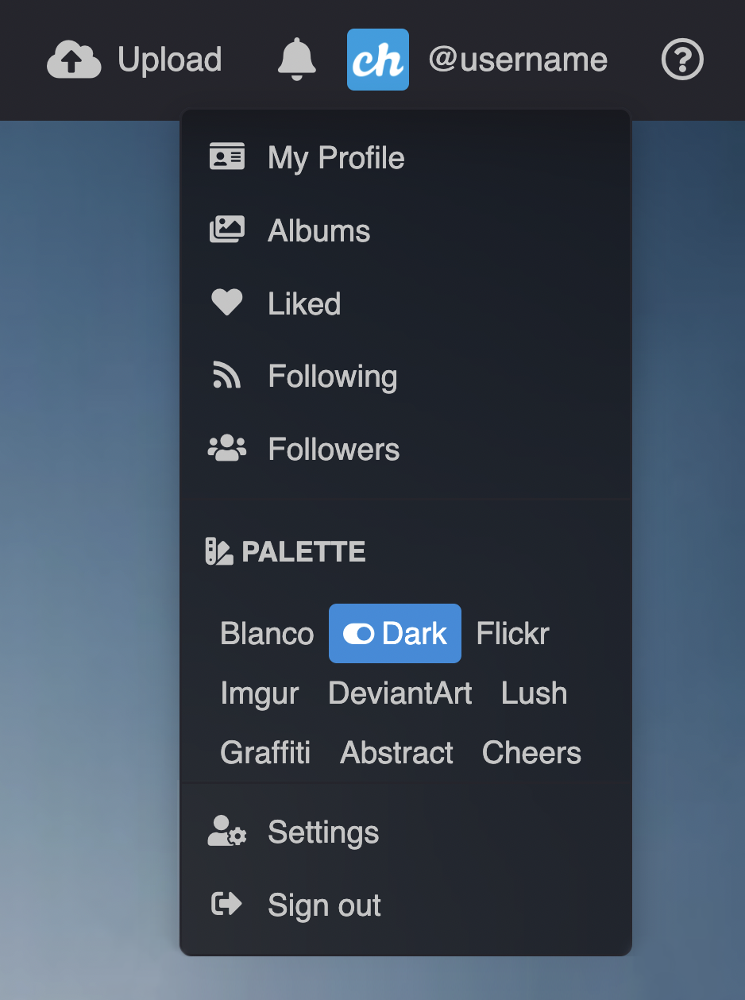

# Personalizar perfil

## `/settings/profile`

## Editar perfil

### Avatar

Suba o actualice su avatar:

### Privacidad

Cofigure la privacidad de la cuenta:

Por defecto viene desactivado.

### Nombre

Cambie o actualice el nombre de perfil:

::: tip Nombre de la cuenta
Si quieres saber cómo cambiar el nombre de la cuenta, 👉🏻 [Click aquí](../account/account.md)
:::

### Web

Agregue su pagina web:

### Bio

Actualice su bio:

### Background

Para cambiar el fondo de perfil, diríjase a su perfil:

- Click en el ícono de usuario ubicado en la topbar y luego click en **Mi Perfil**.
- Bajo el logo del sitio encontrará el botón **Subir fondo de perfil**.
- Seleccione su fondo.

- Luego puede cargar uno nuevo o elinimar el actual.

### Paletas

::: warning Login necesario
Las paletas están disponibles solo si estás logeado
:::

Para cambiar la paleta de colores del sistema, puede hacerlo directamente dando click en su perfil:

