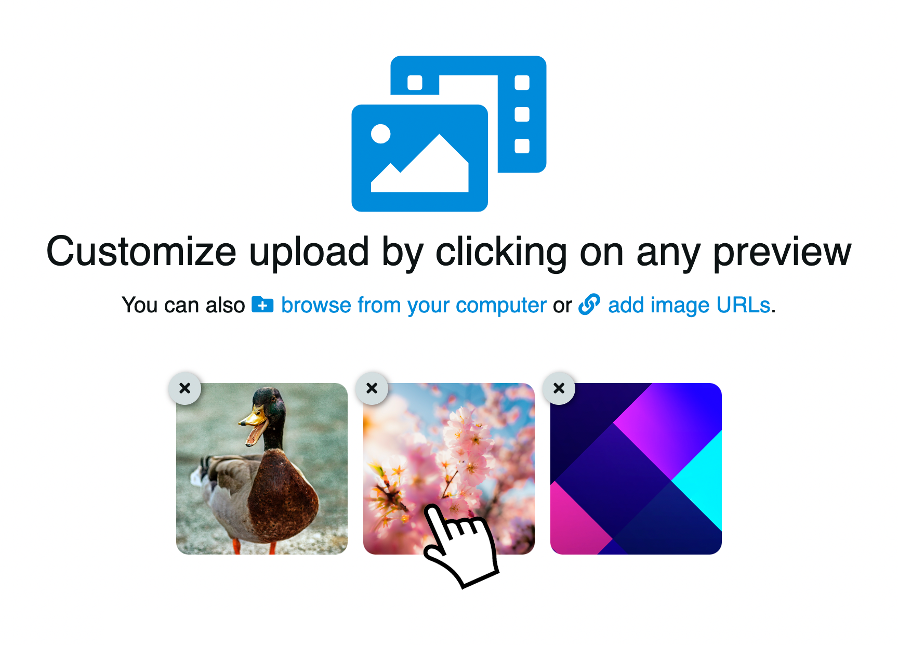
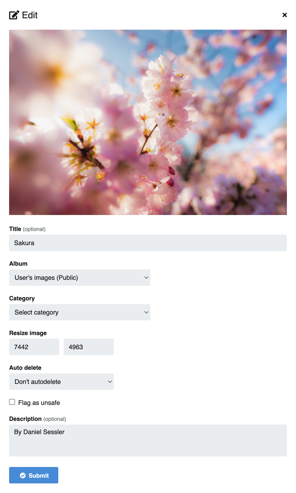

# Upload

## Formatos soportados

::: tip Formatos
Por defecto, Chevereto soporta los formatos de imagen **JPG, PNG, BMP, GIF, WEBP**.
:::

## Upload básico

1. Click en el botón principal del home o en **Subir** ubicado en la barra superior.
2. Seleccione las imágenes que quiera subir desde su computador o suba imágenes mediante URLs. Tambien puede arrastrar y soltar o copiar y pegar imágenes
3. Opcionalmente puede seleccionar el álbum, categoría y si es o no contenido apto para la familia(*)
4. Click en el botón **Subir**
5. Una vez la carga finalice, puede crear nuevo álbum y acceder a los codigos para compartir(*)

::: warning Nota (*)
Algunos formatos podrían estar desabilitados por el administrador del sistema.
:::

<video class="media-screen" width="100%" controls autoplay>
    <source src="../src/manual/upload/upload.webm" type="video/webm">
</video>

## Opciones avanzadas

Después de haber seleccionado las imágenes para la carga, puede editar cualquiera de estas haciendo click en la vista previa.

Al hacer click, se abrirá una ventana en donde usted podrá editar:

- Título
- Álbum
- Categoría
- Redimencionar imagen
- Auto eliminar
- Marcar como inseguro
- Descripción

- Con los valores listos, click en **Enviar**
- Finalmente para subir el contenido, click en **Subir**

## Subir mediante URL

Suba sus imágenes mediante url de la misma manera que cualquier otra imagen.

- Click en el botón **Subir** ubicado en la barra superior.
- Click en agregar URL.
- Pegue los enlaces en el cuadro
- Finalmente click en **Subir**

<video class="media-screen" width="100%" controls autoplay>
    <source src="../src/manual/upload/addurl.webm" type="video/webm">
</video>

::: warning Ojo 👀
La subida mediante URL podría estar desabilitados por el administrador del sistema.
:::

::: tip Sugerencia
👉🏻 [Personalice la cuenta de usuario](../settings/user/profile.md)
:::
