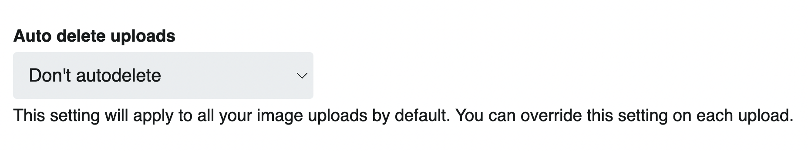
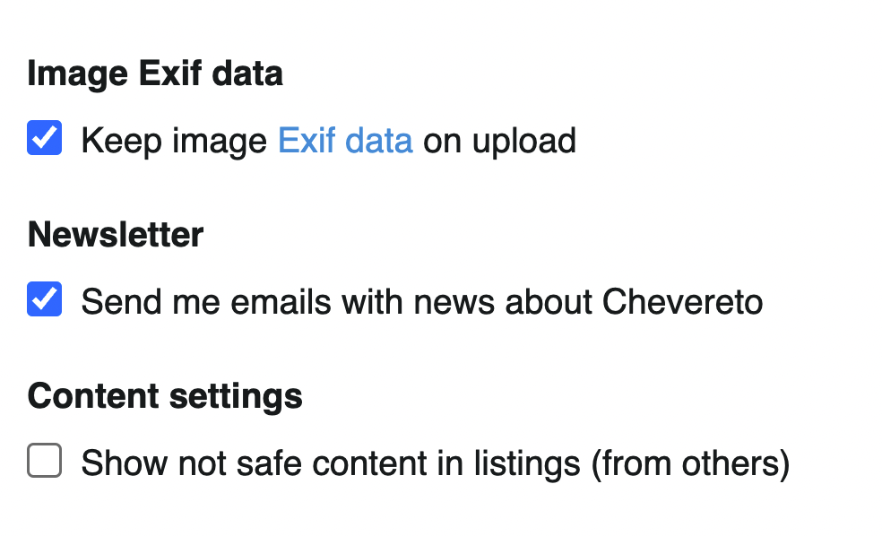
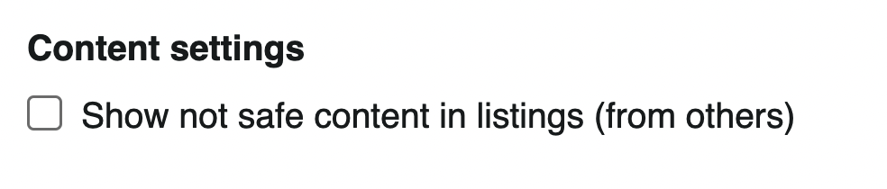
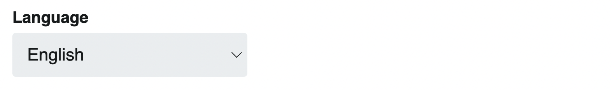
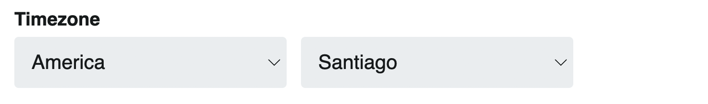
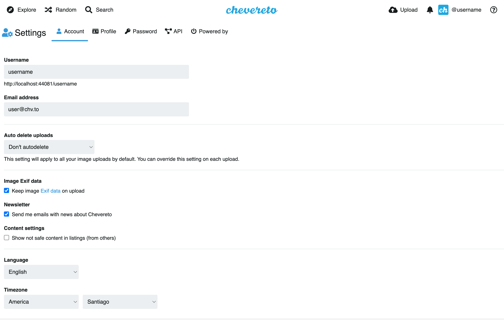

# 🎩 Cuenta

`/settings`

En esta sección se pueden ajustar las configuraciones generales de cuenta de usuario.

## Acceder a ajustes

Para acceder a los ajustes de cuenta desde **cualquier lugar**:

* En la barra superior, click en el **Ícono de usuario** (requiere [🔐 Ingreso](../account/login.md))
* Click en **Ajustes**

Para acceder desde **perfil de usuario**:

* Click en el botón **Editar**

## Nombre de usuario

El nombre de usuario es el identificador alfanumérico de la cuenta. Este identificador es único por usuario.

## Email

El correo electrónico asociado a la cuenta de usuario. Esta dirección de correo se utilizara para todo tipo de comunicaciones con el usuario.

## Auto eliminar subidas

Puede configurar la eliminación automatica del contenido subido. El rango va desde 5 minutos, hasta 1 año.

## Datos Exif de imagen

Active o desactive datos **Exif**(*), estos son metadatos contenidos en las imágenes. Cuando esta deshabilitado Chevereto removerá esa información del archivo de imagen.

::: tip 📷 Exif
Los metadatos Exif brindan información específica sobre las imágenes capturadas por una cámara digital. Incluyendo marca de tiempo, exposición, lugar, etc.
:::

## Ajustes de contenido

### No mostrar contenido no seguro

Al marcar esta opción lás imágenes NSFW (no seguras para entorno trabajo) no se mostrarán en los listados.

## Idioma

Chevereto detecta automáticamente el idioma. Adicionalmente se puede forzar el uso de un idioma a elección.

## Zona horaria

La zona horaria permite determinar la hora local del usuario.

<!--  -->
