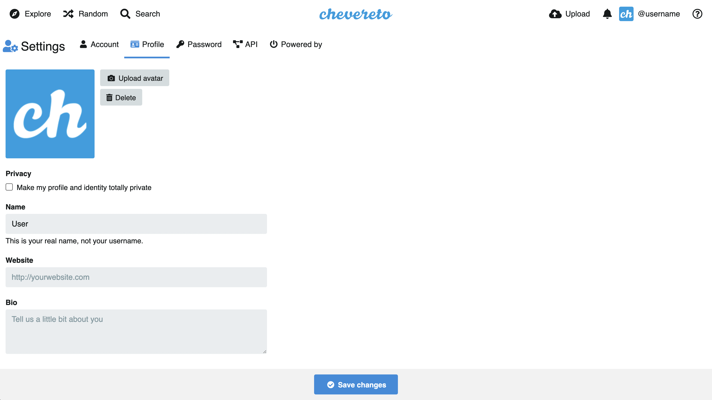

# 🤙 Perfil

`/settings/profile`

En esta sección puede configurar los ajustes de su perfil de usuario.

<!--  -->

## Avatar

El avatar corresponde a la imagen de usuario y se usará extensivamente para indicar al usuario y/o su contenido.

## Privacidad

El perfil de usuario puede ser publico o privado. Cuando el perfil es privado, se oculta a otros la identidad del usuario en sus interacciones con el sistema.

## Nombre

El nombre corresponde al nombre de usuario, esto es idealmente el nombre real del usuario.

## Página web

La página web corresponde a la URL de usuario, esto es el página web personal o cualquier otra URL.

## Bio

La biografía corresponde a una auto-descripción, esto es lo que le cuentas a otros sobre ti.

